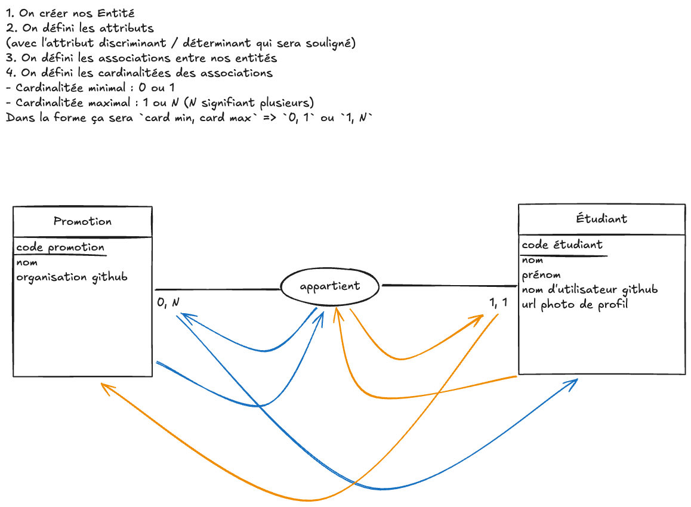

# Modèle logique de données (MLD)

## MCD



## MLD

On va partir du MCD pour créer le MLD.

```mld
PROMO (id, name, github_organization)
STUDENT (id, github_username, first_name, last_name, profile_picture_url, #promo_id)
```

L'id lui est considéré comme une **clé primaire**. C'est une données qui identifie de manière unique une ligne dans une table.

Une colonne qui fait référence à une autre table est précédée d'un dièse `#`. On appel ce champ une **clé étrangère**.
